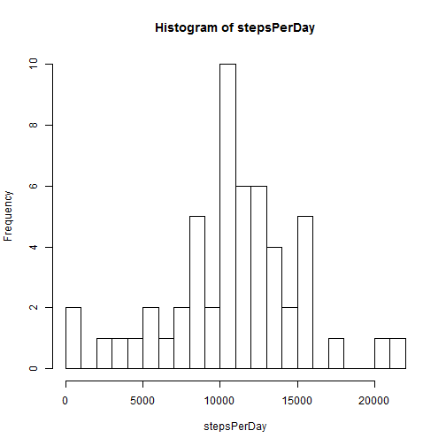
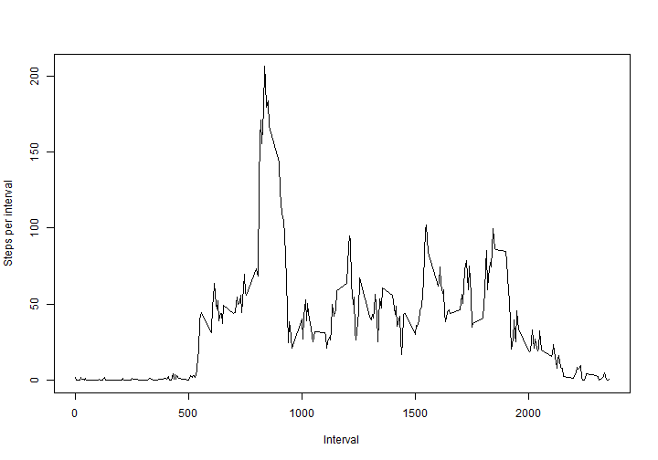
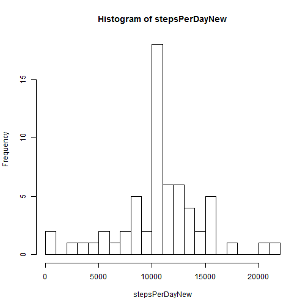
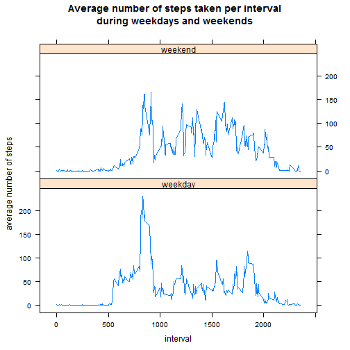

Reproducible Research Peer Assessment 1  
author: Salim Elzwawi  
date: 20/7/2014  


### Summary:
This is an R Markdown document done for peer assignment#1 as part of the Reproducible Research Coursera class offered by John Hopkins University.

### Loading the data
The data is downloaded from the following site (https://d396qusza40orc.cloudfront.net/repdata%2Fdata%2Factivity.zip). The data is then unziped and read as a csv.


```r
url<-"http://d396qusza40orc.cloudfront.net/repdata%2Fdata%2Factivity.zip"
download.file(url,"data.zip")
unzip("data.zip")
data<-read.csv("activity.csv",sep=",",quote="\"'",header=TRUE)
```

### Analysis
The commands below show the first six rows and the summary of the data set under consideration.

```r
head(data)
```

```
##   steps       date interval
## 1    NA 2012-10-01        0
## 2    NA 2012-10-01        5
## 3    NA 2012-10-01       10
## 4    NA 2012-10-01       15
## 5    NA 2012-10-01       20
## 6    NA 2012-10-01       25
```

```r
summary(data)
```

```
##      steps               date          interval   
##  Min.   :  0.0   2012-10-01:  288   Min.   :   0  
##  1st Qu.:  0.0   2012-10-02:  288   1st Qu.: 589  
##  Median :  0.0   2012-10-03:  288   Median :1178  
##  Mean   : 37.4   2012-10-04:  288   Mean   :1178  
##  3rd Qu.: 12.0   2012-10-05:  288   3rd Qu.:1766  
##  Max.   :806.0   2012-10-06:  288   Max.   :2355  
##  NA's   :2304    (Other)   :15840
```


#### Calculating thr mean total number of steps taken per day?
The command below calculates total steps per day.

```r
stepsPerDay<-tapply(na.omit(data)$steps,list(na.omit(data)$date),sum)
```
The histogram of the total steps per day. It indicates that the mean and the median are slightly above 10000.

```r
hist(stepsPerDay,breaks=20)
```

 

In calculating the mean and median of total steps per day, the NA values were ignored.

```r
mean(stepsPerDay,na.rm=TRUE)
median(stepsPerDay,na.rm=TRUE)
```

```
## [1] 10766
```

```
## [1] 10765
```

#### The average daily activity pattern
To answer the question, the steps taken per interval over all days are averaged and the resulting data are plotted.       

```r
stepsPerInt<-tapply(na.omit(data)$steps,list(na.omit(data)$interval),mean)
plot(names(stepsPerInt),stepsPerInt,type="l",xlab="Interval",ylab="Steps per interval")
```

 
Which 5-minute interval, on average across all the days in the dataset, contains the maximum number of steps?

```r
names(stepsPerInt[stepsPerInt==max(stepsPerInt)])
```

```
## [1] "835"
```
On average the maximum number of steps is taken during the 8:30-8:35 am 5-minute interval.   

#### Imputing missing values
The data set summary reveals that there is 2304 missing values. This number is confirmed again below using the sum command.


```r
#Calculate missing values
sum((!complete.cases(data)))
```

```
## [1] 2304
```
The missing values are filled with the average steps taken per interval in which the value is missing.


```r
filledData<-data #new data set where I will remove missing values
intervals<-as.numeric(levels(factor(filledData$interval))) #vector of intervals

#Replaces the missing values with the average steps taken per that interval
for(i in intervals){
   filledData[is.na(filledData$steps) & filledData$interval==i,1]<-stepsPerInt[names(stepsPerInt)==i][[1]]
}
summary(filledData)
nrow(filledData)
```

```
##      steps               date          interval   
##  Min.   :  0.0   2012-10-01:  288   Min.   :   0  
##  1st Qu.:  0.0   2012-10-02:  288   1st Qu.: 589  
##  Median :  0.0   2012-10-03:  288   Median :1178  
##  Mean   : 37.4   2012-10-04:  288   Mean   :1178  
##  3rd Qu.: 27.0   2012-10-05:  288   3rd Qu.:1766  
##  Max.   :806.0   2012-10-06:  288   Max.   :2355  
##                  (Other)   :15840
```

```
## [1] 17568
```
The resulting data frame `filledData` contains no missing values and has the same number of rows as the original data set.  
The new histogram of the total steps taken per day using `filledData` data set is displayed below. 

```r
stepsPerDayNew<-tapply(filledData$steps,list(filledData$date),sum)
hist(stepsPerDayNew,breaks=20)
```

 

As shown above, the shape of the distribution did not change at all, but the frequency of total steps per day increased equally for all days. The new mean and median values are calulcated below.


```r
mean(stepsPerDayNew,na.rm=TRUE)
median(stepsPerDayNew,na.rm=TRUE)
```

```
## [1] 10766
```

```
## [1] 10766
```
Mean remained unchanged while the median increased by a negligible 1 step per day. Filling the missing values with the average of steps per interval did not have any effect on the summary statistics.

#### Are there differences in activity patterns between weekdays and weekends?
To identify observations that were taken during the weekends, a new factor column with levels weekend and weekday is created. 

```r
filledData<-data.frame(filledData,weekend=0)
weekends<-weekdays(as.Date(filledData$date)) %in% c("Sunday","Saturday")
filledData[weekends,]$weekend<-1
filledData$weekend<-factor(filledData$weekend,labels=c("weekday","weekend"))
summary(filledData)
```

```
##      steps               date          interval       weekend     
##  Min.   :  0.0   2012-10-01:  288   Min.   :   0   weekday:12960  
##  1st Qu.:  0.0   2012-10-02:  288   1st Qu.: 589   weekend: 4608  
##  Median :  0.0   2012-10-03:  288   Median :1178                  
##  Mean   : 37.4   2012-10-04:  288   Mean   :1178                  
##  3rd Qu.: 27.0   2012-10-05:  288   3rd Qu.:1766                  
##  Max.   :806.0   2012-10-06:  288   Max.   :2355                  
##                  (Other)   :15840
```
To see the differences in activity patterns a plot is made, containing a time series (i.e. type = "l") of the 5-minute interval (x-axis) and the average number of steps taken, averaged across all weekday days or weekend days (y-axis).

```r
require(reshape)
```

```
## Warning: package 'reshape' was built under R version 3.0.3
```

```r
require(lattice)
```

```
## Warning: package 'lattice' was built under R version 3.0.3
```

```r
# Calculate average steps taken per interval by weekdays and weekends
stepsPerIntWeek<-tapply(filledData$steps,list(filledData$interval,filledData$weekend),mean)

# Panel plot the weekend weekday activity
stepsPerIntWeek<-melt(stepsPerIntWeek,varnames=c("interval","weekday"))
xyplot(value~interval|factor(weekday),
       stepsPerIntWeek,type="l",
       layout=c(1,2),
       main="Average number of steps taken per interval\nduring weekdays and weekends",
       ylab="average number of steps")
```

 

Obviously, people take fewer steps in the morning during the weekends, but more steps in the afternoon and in the evening.

